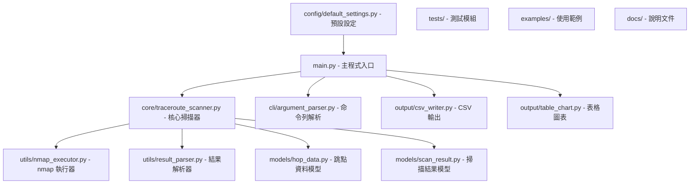

# Python + nmap Traceroute 工具專案架構

## 專案概述

基於 `perpose.md` 需求，建立一個使用 Python 和 nmap 的 Traceroute 工具，支援 TCP/UDP 協定選擇，輸出 CSV 檔案和表格式圖表。

## 專案需求

1. **核心功能**：使用 Python + nmap 建立 Traceroute 工具
2. **協定支援**：靈活使用 UDP/TCP 協定
3. **端口選擇**：能選擇不同 port 進行 traceroute
4. **輸出格式**：產生 CSV 檔案和表格式圖表
5. **範例命令**：`nmap -p 443 --traceroute -vv 8.8.8.8`

## 專案架構圖



## 目錄結構

```
nmapTraceroute/
├── main.py                          # 主程式入口
├── pyproject.toml                   # 專案配置
├── README.md                        # 專案說明
├── requirements.txt                 # 依賴清單
├── PROJECT_ARCHITECTURE.md         # 架構文件
│
├── config/
│   ├── __init__.py
│   └── default_settings.py         # 預設參數配置
│
├── core/
│   ├── __init__.py
│   └── traceroute_scanner.py        # 主要掃描器類別
│
├── cli/
│   ├── __init__.py
│   └── argument_parser.py           # 命令列參數處理
│
├── utils/
│   ├── __init__.py
│   ├── nmap_executor.py             # nmap 命令執行器
│   ├── result_parser.py             # nmap 輸出解析器
│   └── validators.py                # 輸入驗證
│
├── models/
│   ├── __init__.py
│   ├── hop_data.py                  # 單一跳點資料結構
│   └── scan_result.py               # 完整掃描結果結構
│
├── output/
│   ├── __init__.py
│   ├── csv_writer.py                # CSV 檔案輸出
│   └── table_chart.py               # 表格式圖表生成
│
├── tests/
│   ├── __init__.py
│   ├── test_traceroute_scanner.py   # 核心功能測試
│   ├── test_output.py               # 輸出功能測試
│   └── test_utils.py                # 工具函數測試
│
├── examples/
│   ├── basic_scan.py                # 基本掃描範例
│   ├── batch_scan.py                # 批量掃描範例
│   └── custom_ports.py              # 自訂端口範例
│
├── docs/
│   ├── USAGE.md                     # 使用說明
│   ├── API.md                       # API 文件
│   └── INSTALLATION.md              # 安裝指南
│
└── output_data/                     # 輸出檔案目錄
    ├── csv/                         # CSV 檔案
    ├── charts/                      # 圖表檔案
    └── logs/                        # 日誌檔案
```

## 核心模組設計

### 1. TracerouteScanner 類別 (`core/traceroute_scanner.py`)

```python
class TracerouteScanner:
    """主要的 Traceroute 掃描器"""
    
    def __init__(self, protocol='tcp', max_hops=30, timeout=5):
        """初始化掃描器參數"""
        
    def scan_target(self, target, ports, protocol='tcp'):
        """掃描指定目標和端口"""
        
    def scan_multiple_targets(self, targets_file):
        """批量掃描多個目標"""
        
    def get_scan_results(self):
        """取得掃描結果"""
```

### 2. NmapExecutor 類別 (`utils/nmap_executor.py`)

```python
class NmapExecutor:
    """nmap 命令執行器"""
    
    def build_command(self, target, ports, protocol, options):
        """建構 nmap 命令"""
        
    def execute_scan(self, command):
        """執行 nmap 掃描"""
        
    def validate_nmap_installation(self):
        """檢查 nmap 是否已安裝"""
```

### 3. 資料模型 (`models/`)

```python
# hop_data.py
@dataclass
class HopData:
    hop_number: int
    ip_address: str
    hostname: Optional[str]
    rtt_ms: float
    
# scan_result.py
@dataclass
class ScanResult:
    target: str
    port: int
    protocol: str
    hops: List[HopData]
    scan_time: datetime
```

### 4. 輸出模組

#### CSV 輸出 (`output/csv_writer.py`)
- 將 traceroute 結果寫入 CSV 檔案
- 包含跳點編號、IP 位址、主機名稱、延遲時間等欄位

#### 表格圖表 (`output/table_chart.py`)
- 使用 `rich` 或 `tabulate` 生成美觀的表格
- 包含統計資訊：平均延遲、最大延遲、總跳點數
- 支援匯出為 HTML 表格

## 主要依賴套件

```toml
[project]
dependencies = [
    "rich>=13.0.0",           # 美觀的表格和終端輸出
    "click>=8.0.0",           # 命令列介面
    "pandas>=2.0.0",          # CSV 資料處理
    "tabulate>=0.9.0",        # 表格格式化
    "pydantic>=2.0.0",        # 資料驗證
    "loguru>=0.7.0",          # 日誌管理
]
```

## 使用範例

### 基本使用
```bash
# 掃描單一目標
python main.py --target 8.8.8.8 --port 443 --protocol tcp

# 輸出 CSV 和表格
python main.py --target example.com --port 80,443 --output-csv results.csv --show-chart

# 批量掃描
python main.py --targets-file targets.txt --protocol udp --output-dir ./results/
```

### 程式化使用
```python
from core.traceroute_scanner import TracerouteScanner

scanner = TracerouteScanner(protocol='tcp', max_hops=20)
result = scanner.scan_target('8.8.8.8', [443])
print(result.to_table())
```

## CLI 介面設計

```
Usage: python main.py [OPTIONS]

Options:
  -t, --target TEXT          目標主機 (IP 或域名)
  -f, --targets-file PATH    批量掃描目標檔案
  -p, --ports TEXT           端口 (單一或範圍，如: 80,443 或 1-1000)
  --protocol [tcp|udp]       使用的協定 (預設: tcp)
  --max-hops INTEGER         最大跳點數 (預設: 30)
  --timeout INTEGER          超時時間秒數 (預設: 5)
  --output-csv PATH          輸出 CSV 檔案路徑
  --output-dir PATH          輸出目錄
  --show-chart              顯示表格圖表
  --verbose                 詳細輸出模式
  --help                    顯示說明
```

## 表格輸出格式

```
┌─────┬─────────────────┬──────────────────────────────┬─────────────┐
│ Hop │ IP Address      │ Hostname                     │ RTT (ms)    │
├─────┼─────────────────┼──────────────────────────────┼─────────────┤
│  1  │ 192.168.1.1     │ gateway.local                │ 1.234       │
│  2  │ 10.0.0.1        │ isp-gateway.example.com      │ 12.567      │
│  3  │ 203.69.123.45   │ router.telecom.tw            │ 25.891      │
│ ... │ ...             │ ...                          │ ...         │
│ 15  │ 8.8.8.8    │ target.example.com           │ 45.123      │
└─────┴─────────────────┴──────────────────────────────┴─────────────┘

Statistics:
- Total Hops: 15
- Average RTT: 28.45 ms
- Max RTT: 67.89 ms
- Target Reached: Yes
```

## 開發階段規劃

### Phase 1: 基礎架構
1. 建立專案目錄結構
2. 設定 pyproject.toml 和依賴
3. 實作基本的 nmap 執行器
4. 建立資料模型

### Phase 2: 核心功能
1. 實作 TracerouteScanner 類別
2. 實作結果解析器
3. 建立命令列介面
4. 基本測試

### Phase 3: 輸出功能
1. 實作 CSV 輸出功能
2. 實作表格圖表顯示
3. 新增批量掃描支援
4. 完善錯誤處理

### Phase 4: 完善與測試
1. 撰寫完整測試案例
2. 新增使用範例
3. 撰寫說明文件
4. 效能優化

## 技術考量

1. **安全性**：nmap 需要適當的系統權限
2. **效能**：大量掃描時的資源管理
3. **相容性**：跨平台 nmap 命令差異
4. **錯誤處理**：網路不可達、權限不足等情況
5. **資料驗證**：輸入的 IP 位址和端口驗證

這個架構設計提供了一個完整、模組化的解決方案，能夠滿足 perpose.md 中的所有需求。